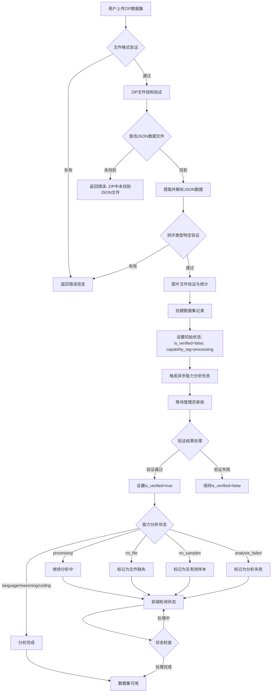
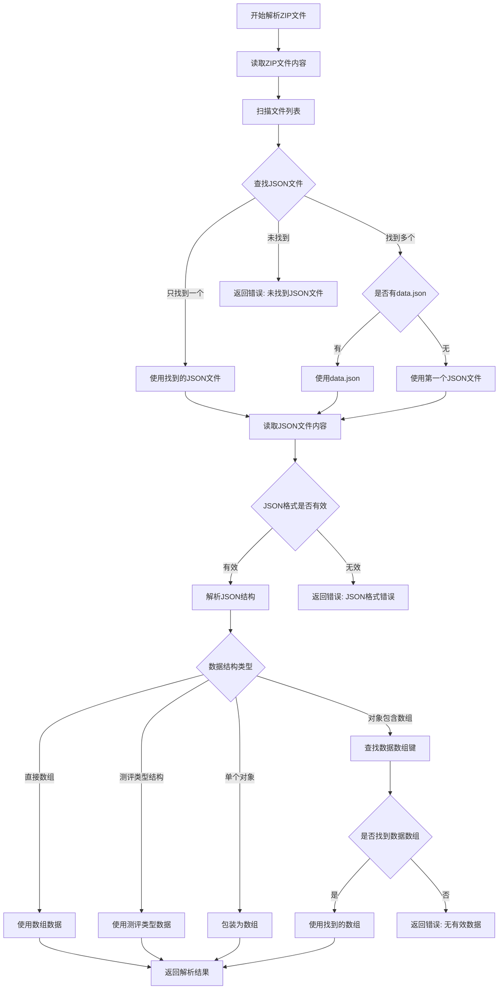
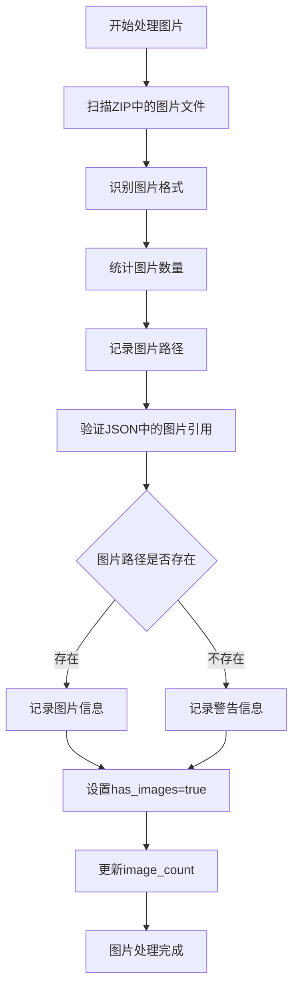
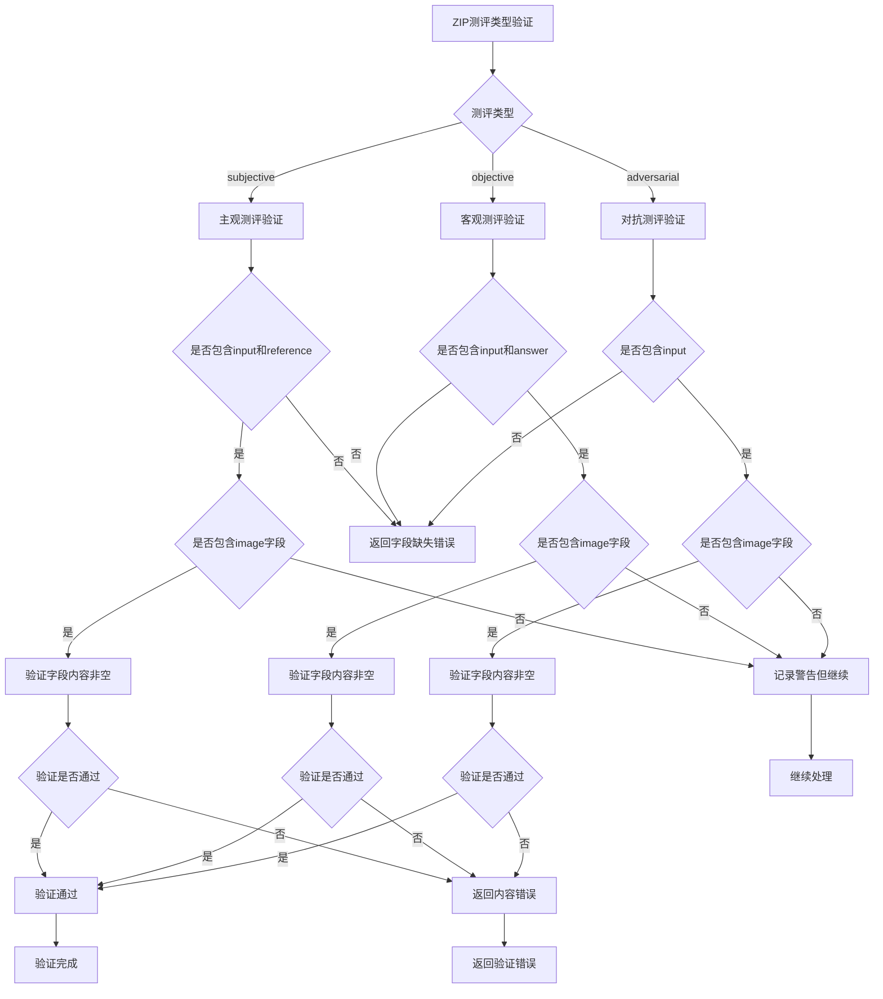
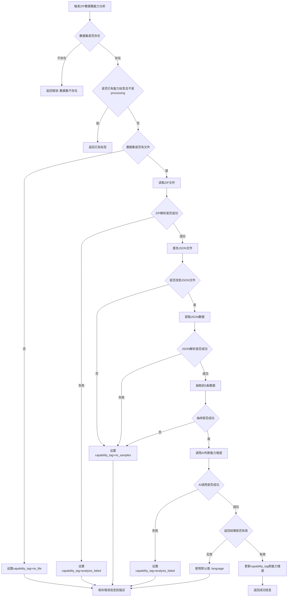
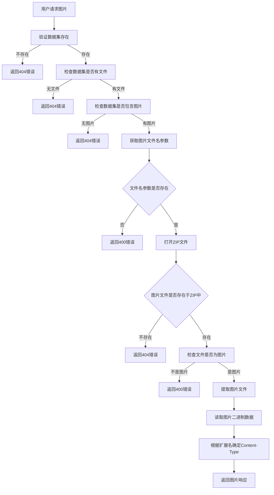
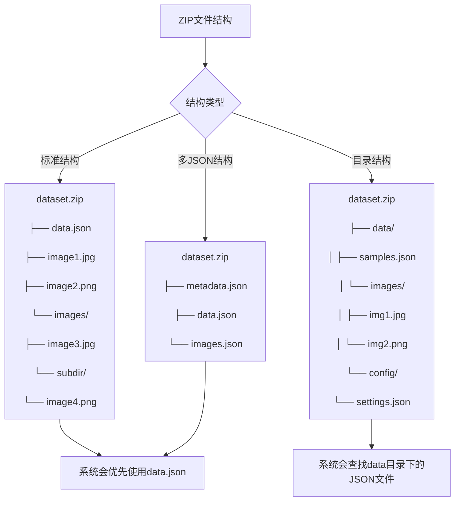

# ZIP数据集审核检测流程图

## 整体流程图



## ZIP文件解析流程



## 图片处理流程



## 测评类型验证流程



## ZIP特有能力分析流程



## 图片访问流程



## ZIP文件结构示例



## 错误处理流程

```mermaid
graph TD
    A[ZIP处理发生错误] --> B{错误类型}
    B -->|ZIP格式错误| C[返回ZIP格式错误信息]
    B -->|JSON解析错误| D[返回JSON格式错误信息]
    B -->|字段验证错误| E[返回字段缺失或格式错误]
    B -->|图片路径错误| F[记录警告但继续处理]
    B -->|能力分析错误| G[记录错误日志]
    B -->|系统错误| H[记录详细错误信息]
    
    C --> I[建议用户检查ZIP文件完整性]
    D --> J[建议用户检查JSON格式]
    E --> K[返回具体字段或格式问题]
    F --> L[在数据集描述中记录警告]
    G --> M{是否可重试}
    H --> M
    
    M -->|是| N[自动重试最多3次]
    M -->|否| O[标记为失败状态]
    
    N --> P{重试是否成功}
    P -->|成功| Q[继续正常流程]
    P -->|失败| R[达到重试上限]
    
    R --> O
    O --> S[更新数据集描述中的错误信息]
    S --> T[通知用户处理失败]